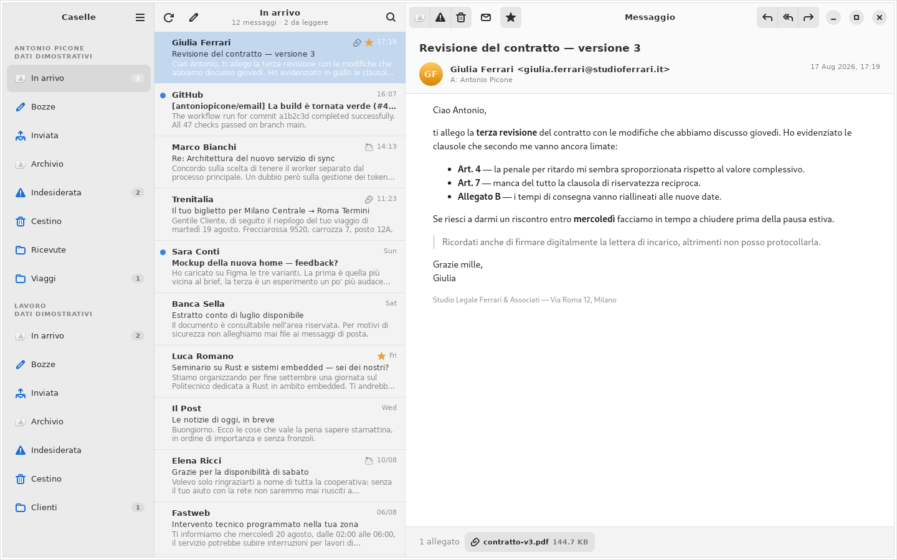
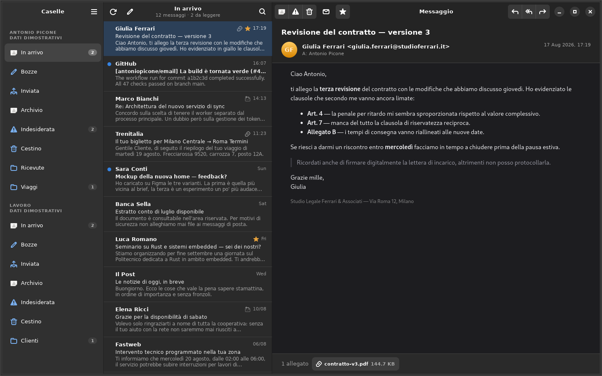
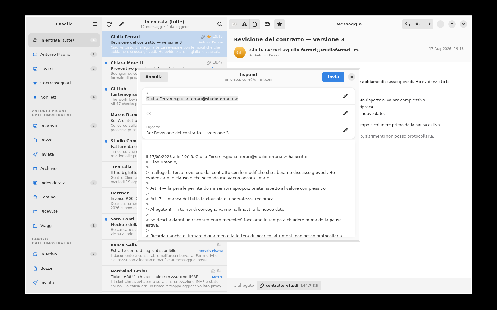
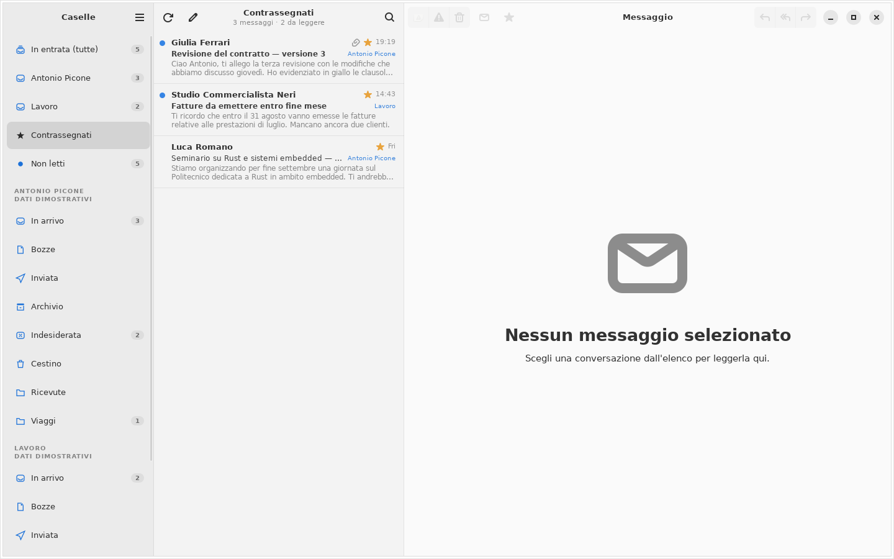
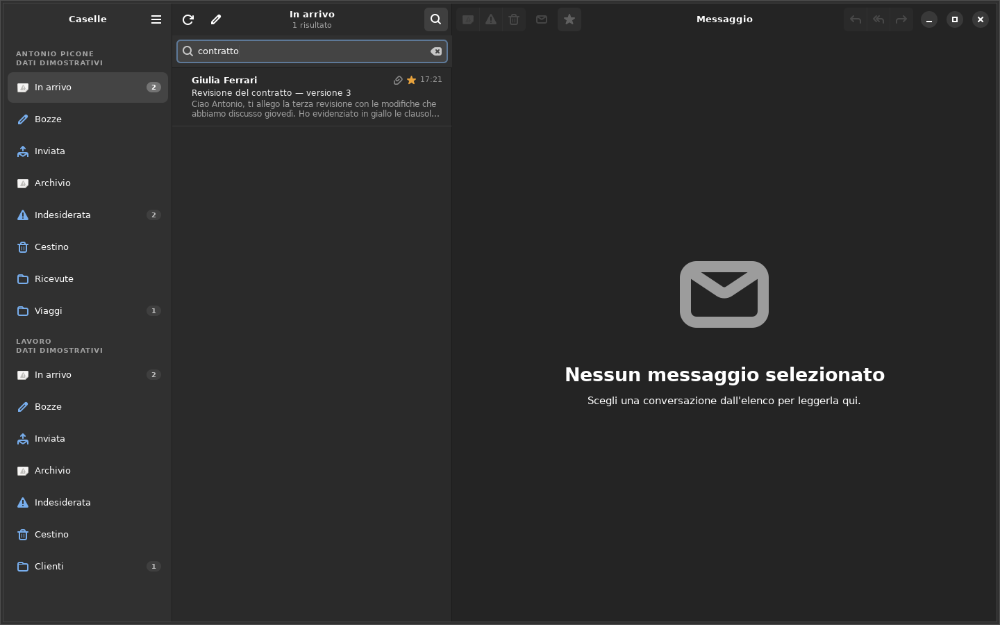
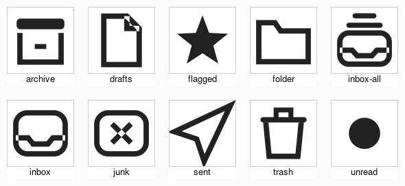

# MailView

Un client di posta per Linux scritto in Rust con GTK4 e libadwaita, con un
layout a tre pannelli in stile Apple Mail, supporto IMAP e Gmail, e
integrazione con gli account online già configurati in GNOME.



## Cosa fa

- **Layout a tre pannelli** come Apple Mail: caselle a sinistra, elenco dei
  messaggi al centro, messaggio a destra. Ogni bordo tra i pannelli è
  trascinabile con il mouse (`GtkPaned`); la larghezza scelta viene
  ricordata alla chiusura dell'app.
- **Cache locale dei messaggi**: l'elenco di ogni cartella e i messaggi già
  aperti restano su disco, così la cartella mostra subito qualcosa mentre la
  rete risponde e riaprire un messaggio non richiede un nuovo scaricamento.
- **Caricamento lento (lazy load)**: la prima pagina di una cartella carica
  `page_size` messaggi; scorrendo fino in fondo all'elenco ne arrivano altri
  automaticamente, finché la cartella non è esaurita.
- **Vista unificata** sul modello di Mail per iOS: *In entrata (tutte)* fonde
  la posta in arrivo di ogni account ordinandola per data, con scorciatoie per
  le singole caselle e le caselle intelligenti *Contrassegnati* e *Non letti*.
  Ogni riga indica da quale account proviene. Con un solo account la sezione
  non compare.
- **Set di icone proprio**, disegnato sul linguaggio visivo di Mail per iOS e
  compilato dentro il binario, quindi indipendente dal tema di sistema.
- **Icona dell'applicazione** in stile Adwaita (busta su sfondo blu
  sfumato), installabile con `tools/install.sh`.
- **Badge dei messaggi da leggere** sull'icona nel dock/taskbar, per gli
  ambienti che supportano il protocollo `com.canonical.Unity.LauncherEntry`
  (es. Budgie, Cinnamon, Dash to Dock). Su GNOME Shell "di serie", senza
  estensioni per le icone del dock, il segnale viene comunque inviato ma
  nessuno lo mostra.
- **Barra di stato** in fondo alla finestra, con uno spinner e il dettaglio
  di quale casella si sta sincronizzando in questo momento.
- **IMAP su TLS**, con STARTTLS opzionale per i server sulla porta 143.
- **Gmail tramite XOAUTH2**: nessuna password da inserire e nessun flusso
  OAuth da gestire, il token arriva da GNOME Online Accounts.
- **Integrazione con GNOME Online Accounts**: gli account già configurati in
  *Impostazioni → Account online* compaiono all'avvio, senza riconfigurarli.
- **Account IMAP manuali** per i server che GNOME non conosce, con la password
  salvata nel portachiavi di sistema (Secret Service) e mai su disco.
- **Modalità giorno/notte** che segue le impostazioni di sistema, con
  possibilità di forzare chiaro o scuro dal menu.
- **Lettura, risposta e inoltro**: risposta singola o a tutti con citazione del
  testo originale, invio via SMTP e copia archiviata nella cartella *Inviata*.
- **Gestione dei messaggi**: archivia, elimina, segna come indesiderata,
  contrassegna, segna come letto/da leggere — anche trascinando una riga
  (swipe breve da sinistra: letto/da leggere; lungo da sinistra: contrassegna;
  leggero da destra: archivia; lungo da destra: elimina) o tenendola premuta
  per lo stesso elenco di azioni in una finestra modale.
- **Filtro non letti** in cima all'elenco dei messaggi.
- **Ricerca** istantanea su mittente, oggetto e anteprima.
- **Allegati** elencati sotto al messaggio e salvabili con un clic.
- **Composizione**: campi Cc e Ccn nascosti finché non servono, titolo della
  finestra che segue l'oggetto una volta lasciato il campo, e suggerimenti
  di indirizzi mentre si scrive nei campi A/Cc/Ccn — dai mittenti/destinatari
  già visti nella posta caricata e, quando disponibile, dalla Rubrica di
  GNOME (evolution-data-server).

| Modalità scura | Composizione |
| --- | --- |
|  |  |

| Casella intelligente | Ricerca |
| --- | --- |
|  |  |

### Icone



Le icone sono generate da `tools/make-icons.py` e compilate in un GResource.
Sono disegnate come **path pieni**, mai come tratti: GTK ricolora le icone
simboliche iniettando `fill` sugli elementi `path`, e non tocca `stroke`, per
cui un contorno tracciato manterrebbe il colore dichiarato nel file e
sparirebbe su sfondo scuro. Il generatore costruisce quindi i contorni
spostando ogni polilinea sui due lati e riempiendo la fascia risultante, con
giunzioni a spigolo vivo.

Per rigenerarle:

```bash
python3 tools/make-icons.py
```

## Requisiti

Sistema con GTK 4.12 o successivo, libadwaita 1.5+ e WebKitGTK 6.0.

Su Debian/Ubuntu:

```bash
sudo apt install libgtk-4-dev libadwaita-1-dev libwebkitgtk-6.0-dev \
                 libssl-dev pkg-config build-essential
```

Su Fedora:

```bash
sudo dnf install gtk4-devel libadwaita-devel webkitgtk6.0-devel \
                 openssl-devel gcc pkgconf-pkg-config
```

Serve inoltre una toolchain Rust recente (1.80 o successiva).

## Compilazione ed esecuzione

```bash
cargo build --release
./target/release/mailview
```

Eseguito così, senza installarlo, MailView funziona a pieno regime ma
compare nel dock/taskbar con un'icona generica: senza un `.desktop`
installato lo shell non ha modo di risalire all'icona dell'applicazione.
Per installare binario, `.desktop` e icona per il solo utente corrente
(tutto sotto `~/.local`, nessun permesso di root):

```bash
tools/install.sh
```

Per esplorare l'interfaccia senza configurare nulla — nessuna connessione di
rete viene aperta:

```bash
cargo run -- --demo
```

Opzioni disponibili:

| Opzione | Effetto |
| --- | --- |
| `--demo` | usa la casella dimostrativa integrata (due account) |
| `--demo-single` | come `--demo`, ma con un solo account |
| `--no-gnome` | ignora gli account di GNOME Online Accounts |
| `--help` | mostra l'elenco delle opzioni |

## Configurare un account

**Con GNOME Online Accounts (consigliato per Gmail).** Aggiungi l'account in
*Impostazioni → Account online* e assicurati che la voce *Posta* sia attiva.
MailView lo rileva al successivo avvio. Per Gmail il token OAuth2 viene
richiesto a GOA a ogni connessione, quindi il rinnovo è automatico.

**Manualmente.** Menu principale → *Aggiungi account IMAP…*. I server vengono
suggeriti a partire dal dominio dell'indirizzo. Le impostazioni finiscono in
`~/.config/mailview/config.toml`, la password nel portachiavi.

Esempio di `config.toml`:

```toml
theme = "system"              # "system", "light" o "dark"
use_gnome_online_accounts = true
page_size = 100                        # messaggi caricati per pagina (lazy load oltre)
sidebar_width = 260                    # larghezza in pixel del pannello caselle
message_list_width = 380               # larghezza in pixel del pannello messaggi

[[accounts]]
id = "imap:info@example.it"
display_name = "Lavoro"
email = "info@example.it"
imap_host = "imap.example.it"
imap_port = 993
use_starttls = false
smtp_host = "smtp.example.it"
smtp_port = 587
```

## Scorciatoie

| Scorciatoia | Azione |
| --- | --- |
| `Ctrl+N` | nuovo messaggio |
| `Ctrl+Invio` | rispondi |
| `Ctrl+Maiusc+Invio` | rispondi a tutti |
| `Ctrl+R` | aggiorna la cartella |
| `Ctrl+F` | cerca |
| `Ctrl+E` | archivia |
| `Canc` | elimina |

## Architettura

```
src/
  main.rs              avvio, opzioni da riga di comando, raccolta account
  model.rs             tipi condivisi (Account, Mailbox, MessageSummary, …)
  config.rs            impostazioni persistenti degli account manuali
  cache.rs             cache su disco di elenchi e messaggi scaricati
  badge.rs             badge dei non letti sull'icona (Unity LauncherEntry)
  contacts.rs          suggerimenti destinatari: posta vista + Rubrica GNOME
  goa.rs               GNOME Online Accounts via D-Bus (zbus)
  secrets.rs           password nel portachiavi (Secret Service)
  html.rs              sanitizzazione dei corpi HTML e resa in testo
  runtime.rs           runtime Tokio condiviso per le chiamate D-Bus
  demo.rs              casella dimostrativa e worker senza rete
  backend/
    mod.rs             worker per account, canali comando/evento
    imap_client.rs     sessione IMAP sincrona
    xoauth2.rs         meccanismo SASL XOAUTH2
    smtp.rs            invio dei messaggi
  ui/
    mod.rs             finestra principale e cablaggio
    rows.rs            righe di barra laterale ed elenco
    message_view.rs    pannello di lettura con WebView
    compose.rs         finestra di composizione
    accounts.rs        dialogo di aggiunta account
    style.css          foglio di stile
data/
  icons/
    scalable/actions/  icone simboliche generate
    hicolor/           icona dell'applicazione, layout XDG per l'installazione
  mailview.gresource.xml
  it.antoniopicone.MailView.desktop
tools/
  make-icons.py        generatore delle icone simboliche
  install.sh           installa binario, .desktop e icona in ~/.local
  screenshot.sh        cattura su display virtuale
build.rs               compila le icone nel GResource
```

La rete non gira mai sul main loop di GTK. Ogni account ha un thread worker che
possiede la propria sessione IMAP; l'interfaccia invia `Command` su un canale
`mpsc` e riceve `Event` su un canale asincrono che il main context di GLib
consuma. Se una connessione cade, il worker la ricostruisce al comando
successivo invece di lasciare l'account inutilizzabile fino al riavvio.

### Sicurezza dei messaggi

I corpi HTML passano da `ammonia` prima di raggiungere la WebView: script,
gestori di eventi, `iframe`, `object`, `embed` e `form` vengono rimossi. La
WebView ha JavaScript, database locali e local storage disattivati, e le
immagini remote non vengono caricate, così l'apertura di un messaggio non
conferma al mittente che è stato letto. I link aprono il browser di sistema
invece di navigare dentro la finestra.

## Test

```bash
cargo test
```

I test coprono la logica pura: classificazione delle cartelle IMAP
(SPECIAL-USE e nomi localizzati), formattazione delle date in stile Apple Mail,
sanitizzazione HTML, analisi dei destinatari, prefissi `Re:`/`Fwd:` e
deduzione dei server dal dominio dell'indirizzo.

## Screenshot

Gli screenshot si rigenerano su un display virtuale:

```bash
tools/screenshot.sh docs/screenshots/01-light.png --scheme light -- --demo
```

Lo script avvia Xvfb con un window manager, lancia l'applicazione e cattura la
finestra. Accetta `--scheme light|dark`, `--size WxH`, `--key` per inviare una
scorciatoia, `--click X,Y` per fare clic, `--type` per digitare e `--root` per
catturare l'intero schermo.

## Stato

Funzionante per l'uso quotidiano di lettura e risposta. Non ancora
implementati: thread di conversazione, IDLE per le notifiche push, allegati
in uscita e rimozione degli account dall'interfaccia.

Le caselle intelligenti *Contrassegnati* e *Non letti* lavorano sulla posta in
arrivo caricata, non su una ricerca lato server: coprono quindi i messaggi
visibili nella vista unificata, non l'intero archivio.

## Licenza

MIT — vedi [LICENSE](LICENSE).
